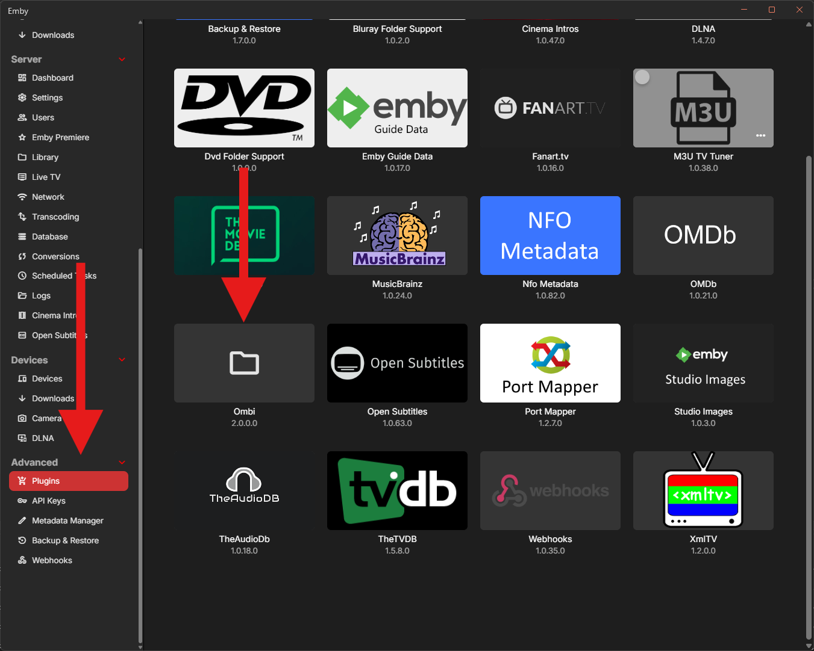

# Ombi unofficial plugin for Emby

This plugin exists to notify Ombi when your Emby library is updated. This helps to speed up request processing. When a new item becomes available in Emby, the corresponding Ombi request will be marked available much faster after installing this plugin.

Features

- Perform a content sync when the library is scanned
- Perform a content sync when an item is added to the library
- Choose between a quick or a complete library sync

## Installing

The plugin is **not** available in the Emby plugins catalog, but manual installation is easy.

Grab the plugin DLL from [the releases](https://github.com/adequate-coder/emby-plugin-ombi-unofficial/releases) page.

Drop it into your Emby server's plugins directory, e.g.

- Windows: %AppData%\Emby-Server\Plugins\
- Docker: /config/plugins

Restart your Emby server

## Configuring

In your Emby server settings, find the Plugins tab (under the Advanced tab group) and click the "Ombi" tile.

Fill in your Ombi server settings and API key, click "Save".

Your settings and API key are validated when you click "Save". If the validation fails, the error message will be displayed, and your settings will not be saved.

Otherwise, you're all set!

## Known issues

Sometimes the Ombi sync takes too long.  
Workaround: enable "fast sync" in the plugin settings. Be sure to follow the instructions right below it, or your library changes won't sync at all.