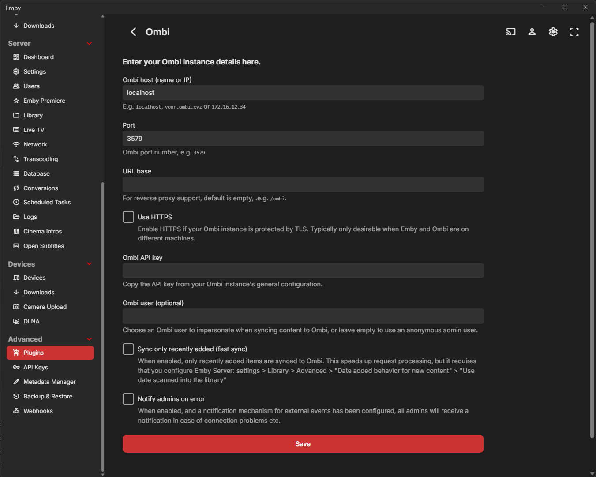

# Ombi unofficial plugin for Emby

This plugin exists to notify Ombi when your Emby library is updated. This helps to speed up request processing. When a new item becomes available in Emby, the corresponding Ombi request will be marked available much faster after installing this plugin.

Features

- Perform a content sync when the library is scanned
- Perform a content sync when an item is added to the library
- Choose between a quick or a complete library sync

## Installing

The plugin is **not** available in the Emby plugins catalog, I shall not be bothered to add it.

Grab the plugin DLL from [the releases](https://github.com/adequate-coder/emby-plugin-ombi-unofficial/releases) page.

Drop it into your Emby server's plugins directory, e.g.

- Windows: %AppData%\Emby-Server\Plugins\
- Docker: /config/plugins

Restart your Emby server

## Configuring

In your Emby server settings, find the Plugins tab (under the Advanced tab group).  
Click the "Ombi" tile.  
Fill in your Ombi server settings, click "Validate" to test the connection and click "Save" to persist your configuration.

## Known issues

The Validate button does not validate the API key.

Sometimes your values are not saved when you click "Save".  
Workaround: do a page refresh. If it still doesn't work, clear your browser cache.

Sometimes the Ombi sync takes too long.  
Workaround: enable "fast sync" in the plugin settings. Be sure to follow the instructions right below it, or your library changes won't sync at all.